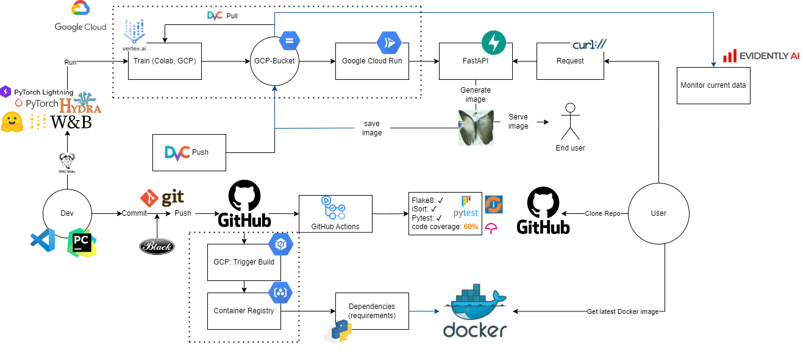
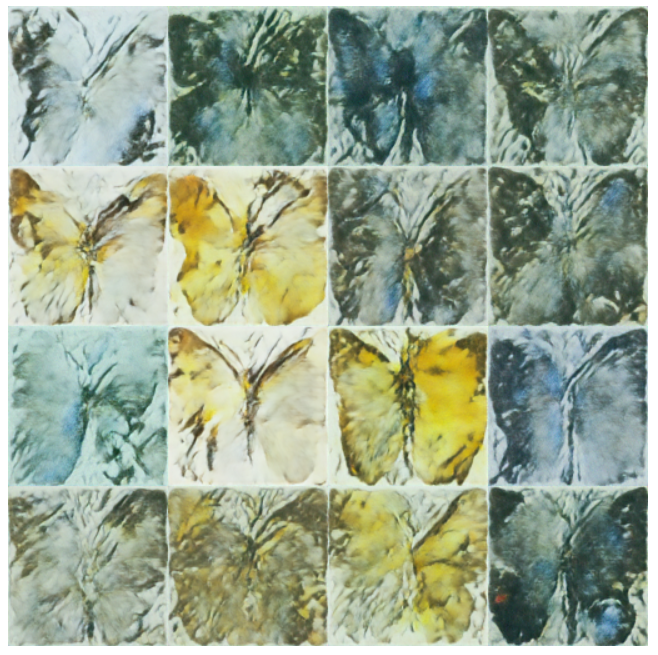

MLOps principles for Butterfly Image generation with Stable Diffusion
==============================
[](https://github.com/AndreasLH/ML_Ops_stable_diffusion/actions/workflows/tests.yml)
[](https://github.com/AndreasLH/ML_Ops_stable_diffusion/actions/workflows/isort.yml)
[](https://github.com/AndreasLH/ML_Ops_stable_diffusion/actions/workflows/flake8.yml)
[](https://codecov.io/gh/AndreasLH/ML_Ops_stable_diffusion)

Project repository for the DTU course Machine Learning Operations (02476). The primary focus is to apply MLOps principles to a larger deep learning project.   

Made by:
- Andreas H: s194235
- Andreas H: s194238
- Yucheng F: s194241
- Christian A: s194255
- Malthe A: s194257

## Overall goal of the project
The goal of the project is to train a Stable Diffusion generative model to generate photorealistic images of butterflies and implement MLOps practices for efficient training and deployment to the cloud. 

|Data specific framework| Training framework |Utility framework|
|:----:|:----:|:----:|
|Huggingface Diffusers|PyTorch Lightning|Hydra|

We are using [Huggingface Diffusers](https://github.com/huggingface/diffusers) as our main framework. PyTorch Lightning is used to reduce the amount of boilerplate, and we use Hydra to configure the experiments. Furthermore, we log relevant information pertaining to the training of models using W&B.

The Huggingface framework provides some convenience functions to load the data that we are going to use, and PyTorch Lightning has some tools to evaluate the quality of the reconstructed images ([Inception score](https://torchmetrics.readthedocs.io/en/stable/image/inception_score.html)).

The model is an unconditional diffusion model, developed by [Google](https://huggingface.co/google/ddpm-cifar10-32). The diffusion model generates images by learning to remove noise. It is unconditional because it can generate images directly from noise, without an additional input, such as a text prompt.

# Data
We are using a dataset called “[Smithsonian butterflies subset](https://huggingface.co/datasets/huggan/smithsonian_butterflies_subset)”. The dataset is a subset of 1000 images of butterflies. 

# Our MLOps stack


# Results
Images generated using our REST API with 500 diffusion steps.


# To set up repo
```
git pull
dvc pull
pip install -r requirements.txt
```
or use the dockerfile
```docker build -f env.dockerfile . -t env:latest```


Project Organization
------------

    ├── LICENSE
    ├── Makefile           <- Makefile with commands like `make data` or `make train`
    ├── README.md          <- The top-level README for developers using this project.
    ├── data
    │   ├── external       <- Data from third party sources.
    │   ├── interim        <- Intermediate data that has been transformed.
    │   ├── processed      <- The final, canonical data sets for modeling.
    │   └── raw            <- The original, immutable data dump.
    │
    ├── docs               <- A default Sphinx project; see sphinx-doc.org for details
    │
    ├── models             <- Trained and serialized models, model predictions, or model summaries
    │
    ├── notebooks          <- Jupyter notebooks. Naming convention is a number (for ordering),
    │                         the creator's initials, and a short `-` delimited description, e.g.
    │                         `1.0-jqp-initial-data-exploration`.
    │
    ├── references         <- Data dictionaries, manuals, and all other explanatory materials.
    │
    ├── reports            <- Generated analysis as HTML, PDF, LaTeX, etc.
    │   └── figures        <- Generated graphics and figures to be used in reporting
    │
    ├── requirements.txt   <- The requirements file for reproducing the analysis environment, e.g.
    │                         generated with `pip freeze > requirements.txt`
    │
    ├── setup.py           <- makes project pip installable (pip install -e .) so src can be imported
    ├── src                <- Source code for use in this project.
    │   ├── __init__.py    <- Makes src a Python module
    │   │
    │   ├── data           <- Scripts to download or generate data
    │   │   └── make_dataset.py
    │   │
    │   ├── features       <- Scripts to turn raw data into features for modeling
    │   │   └── build_features.py
    │   │
    │   ├── models         <- Scripts to train models and then use trained models to make
    │   │   │                 predictions
    │   │   ├── predict_model.py
    │   │   └── train_model.py
    │   │
    │   └── visualization  <- Scripts to create exploratory and results oriented visualizations
    │       └── visualize.py
    │
    └── tox.ini            <- tox file with settings for running tox; see tox.readthedocs.io


--------

