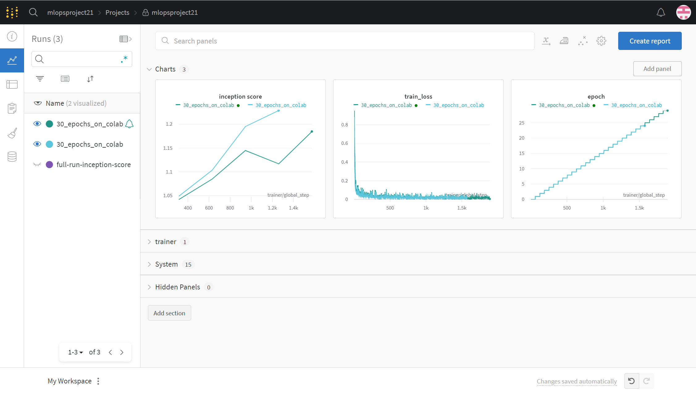
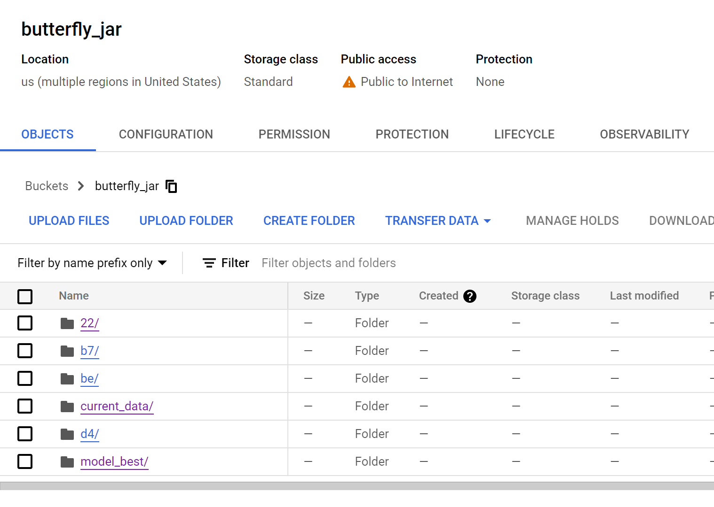
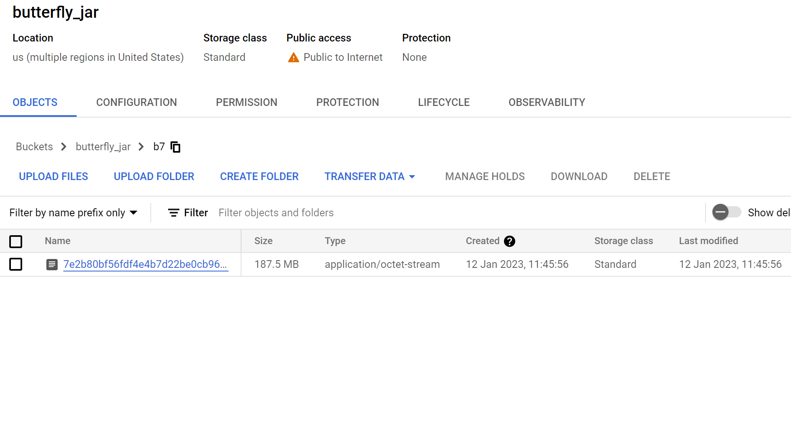
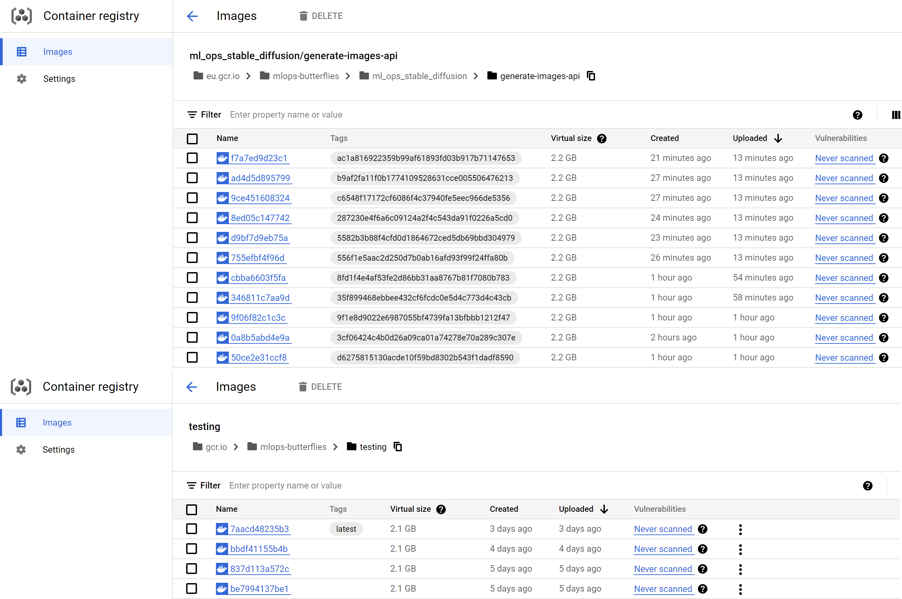
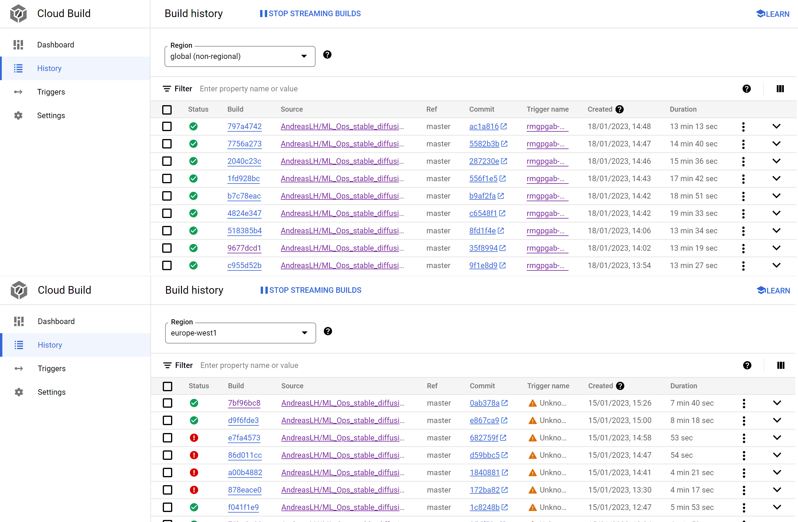
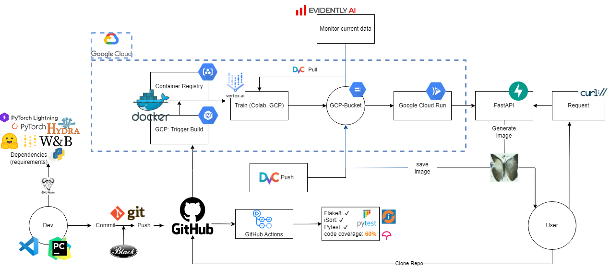

# Exam template for 02476 Machine Learning Operations

This is the report template for the exam. Please only remove the text formatted as with three dashes in front and behind
like:

```--- question 1 fill here ---```

where you instead should add your answers. Any other changes may have unwanted consequences when your report is auto
generated in the end of the course. For questions where you are asked to include images, start by adding the image to
the `figures` subfolder (please only use `.png`, `.jpg` or `.jpeg`) and then add the following code in your answer:

```markdown

```

In addition to this markdown file, we also provide the `report.py` script that provides two utility functions:

Running:

```bash
python report.py html
```

will generate an `.html` page of your report. After deadline for answering this template, we will autoscrape
everything in this `reports` folder and then use this utility to generate an `.html` page that will be your serve
as your final handin.

Running

```bash
python report.py check
```

will check your answers in this template against the constrains listed for each question e.g. is your answer too
short, too long, have you included an image when asked to.

For both functions to work it is important that you do not rename anything. The script have two dependencies that can
be installed with `pip install click markdown`.

## Overall project checklist

The checklist is *exhaustic* which means that it includes everything that you could possible do on the project in
relation the curricilum in this course. Therefore, we do not expect at all that you have checked of all boxes at the
end of the project.

### Week 1

* [x] Create a git repository
* [x] Make sure that all team members have write access to the github repository
* [x] Create a dedicated environment for you project to keep track of your packages
* [x] Create the initial file structure using cookiecutter
* [x] Fill out the `make_dataset.py` file such that it downloads whatever data you need and
* [x] Add a model file and a training script and get that running
* [x] Remember to fill out the `requirements.txt` file with whatever dependencies that you are using
* [x] Remember to comply with good coding practices (`pep8`) while doing the project
* [x] Do a bit of code typing and remember to document essential parts of your code
* [x] Setup version control for your data or part of your data
* [x] Construct one or multiple docker files for your code
* [x] Build the docker files locally and make sure they work as intended
* [x] Write one or multiple configurations files for your experiments
* [x] Used Hydra to load the configurations and manage your hyperparameters
* [ ] When you have something that works somewhat, remember at some point to to some profiling and see if
      you can optimize your code
* [x] Use Weights & Biases to log training progress and other important metrics/artifacts in your code. Additionally,
      consider running a hyperparameter optimization sweep.
* [x] Use Pytorch-lightning (if applicable) to reduce the amount of boilerplate in your code

### Week 2

* [x] Write unit tests related to the data part of your code
* [x] Write unit tests related to model construction and or model training
* [x] Calculate the coverage.
* [x] Get some continuous integration running on the github repository
* [x] Create a data storage in GCP Bucket for you data and preferable link this with your data version control setup
* [x] Create a trigger workflow for automatically building your docker images
* [x] Get your model training in GCP using either the Engine or Vertex AI
* [x] Create a FastAPI application that can do inference using your model
* [x] If applicable, consider deploying the model locally using torchserve
* [x] Deploy your model in GCP using either Functions or Run as the backend

### Week 3

* [x] Check how robust your model is towards data drifting
* [ ] Setup monitoring for the system telemetry of your deployed model
* [x] Setup monitoring for the performance of your deployed model
* [x] If applicable, play around with distributed data loading
* [ ] If applicable, play around with distributed model training
* [x] Play around with quantization, compilation and pruning for you trained models to increase inference speed

### Additional

* [x] Revisit your initial project description. Did the project turn out as you wanted?
* [x] Make sure all group members have a understanding about all parts of the project
* [x] Uploaded all your code to github

## Group information

### Question 1
> **Enter the group number you signed up on <learn.inside.dtu.dk>**
>
> Answer:

Awesome 21

### Question 2
> **Enter the study number for each member in the group**
>
> Example:
>
> *sXXXXXX, sXXXXXX, sXXXXXX*
>
> Answer:

s194235, s194238, s194241, s194255, s194257

### Question 3
> **What framework did you choose to work with and did it help you complete the project?**
>
> Answer length: 100-200 words.
>
> Example:
> *We used the third-party framework ... in our project. We used functionality ... and functionality ... from the*
> *package to do ... and ... in our project*.
>
> Answer:

We used the Diffusers framework by Huggingface in our project to easily implement a denoising diffusion probabilistic model (DDPM). From the diffusers package, we used the DDPMScheduler function to gradually apply noise to an image, the DDPMPipeline function to denoise encoded images from the model and imported a 2D U-Net model. We used Pytorch-Lightning to wrap the model and get access to all the nice features granted for free. We used the functionality to save the best model automatically and to select the device smartly. It was also much easier to log things with W&B through Pytorch lightning. Pytorch lightning also has a metrics library that we used for evaluation during training.

## Coding environment

> In the following section we are interested in learning more about you local development environment.

### Question 4

> **Explain how you managed dependencies in your project? Explain the process a new team member would have to go**
> **through to get an exact copy of your environment.**
>
> Answer length: 100-200 words
>
> Example:
> *We used ... for managing our dependencies. The list of dependencies was auto-generated using ... . To get a*
> *complete copy of our development enviroment, one would have to run the following commands*
>
> Answer:

We have a Conda virtual envrionment specifically for the project and use a `requirements.txt` file to keep track of dependencies. The requirements.txt file was generated by the cookie cutter structure and updated by running the terminal command `pip list --format=freeze > requirements.txt`. The `requirements.txt` file contains all the packages and dependencies, as well as a specific version if required. To get a complete copy of our development environment, one can simply run the following commands: 
`conda create --name MLOps` to create the virtual environment, `conda activate MLOps` to activate the virtual environment, and then `pip install requirements.txt` to install the necessary packages. Additionally, a few other requirements files exist to create a cuda enabled environment.
We have a Conda virtual environment specifically for the project and use a `requirements.txt` file to keep track of dependencies. The `requirements.txt` file was generated by the cookie cutter structure and updated by running the terminal command 

      pip list --format=freeze > requirements.txt

 The requirements.txt file contains all the packages and dependencies, as well as a specific version if required. To get a complete copy of our development environment, one can simply run the following commands: 

      conda create --name MLOps
 to create the virtual environment,
 
      conda activate MLOps
to activate the virtual environment, and then 

      pip install requirements.txt
to install the necessary packages. Additionally, a few other requirements files exist to create a cuda enabled environment.

### Question 5

> **We expect that you initialized your project using the cookiecutter template. Explain the overall structure of your**
> **code. Did you fill out every folder or only a subset?**
>
> Answer length: 100-200 words
>
> Example:
> *From the cookiecutter template we have filled out the ... , ... and ... folder. We have removed the ... folder*
> *because we did not use any ... in our project. We have added an ... folder that contains ... for running our*
> *experiments.*
> Answer:

Using the cookiecutter template we decided to only use the data/processed folder, since the script we are using has built-in functionality to download the raw data from Huggingface. The docs have not been filled, but we do know that they can be made by running `make html` from within `docs`. Notebooks and references were untouched. The best saved models were saved under the `models` folder, alongside the respective log files generated by Hydra such that we could trace back the configuration that the model was trained with. A folder called samples was added to save all the outputs from the trained models. The conf folder was added to keep our Hydra config files. The tests folder was added to contain all the tests we have written in `pytest`.

### Question 6

> **Did you implement any rules for code quality and format? Additionally, explain with your own words why these**
> **concepts matters in larger projects.**
>
> Answer length: 50-100 words.
>
> Answer:

We implemented the following flake8 settings since the default settings were too strict for us. Although, we realise that the line length is probably a bit too relaxed. We wanted to pass the tests for our CI/CD pipelines.
```ini
max-line-length = 170
max-complexity = 15
--ignore = E203, E266, E501, W503
exclude = tests/test_model.py
```
Furthermore, we implemented isort and black as code formatters. These concepts matter in larger projects because each person has their own code style, which might be confusing for the others. By using these formatters, we ensure that the code is standardised for everyone.


## Version control

> In the following section we are interested in how version control was used in your project during development to
> corporate and increase the quality of your code.

### Question 7

> **How many tests did you implement and what are they testing in your code?**
>
> Answer length: 50-100 words.
>
> Example:
> *In total we have implemented X tests. Primarily we are testing ... and ... as these the most critical parts of our*
> *application but also ... .*
>
> Answer:

The tests folder contains the 13 tests perfomed using `pytest`. We test both the training, evaluation, and data loading part of the pipeline. We test if the metrics are of correct datatype, if the output dimensions from the model are correct, as well as if the dimensions of the data is correct. 

### Question 8

> **What is the total code coverage (in percentage) of your code? If you code had an code coverage of 100% (or close**
> **to), would you still trust it to be error free? Explain you reasoning.**
>
> Answer length: 100-200 words.
>
> Example:
> *The total code coverage of code is X%, which includes all our source code. We are far from 100% coverage of our **
> *code and even if we were then...*
>
> Answer:

The total code coverage of the project is 60%, this is for all project files, including some that might not make sense to include in the total tally. Some of the code does not make sense to run a test for since it requires training the model in some regard, which takes a lot of time. Most of the code made is exactly training code which is why the percentage is low. We would rather have a low coverage than have some arbitrary tests that run through code but does not actually do anything. We used the code [coverage website](https://app.codecov.io/gh/AndreasLH/ML_Ops_stable_diffusion) to track the coverage over time and to generate the badge for the Github readme.

### Question 9

> **Did you workflow include using branches and pull requests? If yes, explain how. If not, explain how branches and**
> **pull request can help improve version control.**
>
> Answer length: 100-200 words.
>
> Example:
> *We made use of both branches and PRs in our project. In our group, each member had an branch that they worked on in*
> *addition to the main branch. To merge code we ...*
>
> Answer:

Working on branches and using pull requests were an integral part of the project to secure a steady workflow. Most of the group members created their own branches as to work independently from the main branch, so that it was possible for members to work on the same file simultaneously, e.g. implementing config files through Hydra while working on implementing *weights and biases* in the training loop. Doing this, it was possible to solve merge conflicts locally before creating a pull request to the main branch. Due to the size of the project, however, most of the time it was easier just to work directly on the main branch. 


### Question 10

> **Did you use DVC for managing data in your project? If yes, then how did it improve your project to have version**
> **control of your data. If no, explain a case where it would be beneficial to have version control of your data.**
>
> Answer length: 100-200 words.
>
> Example:
> *We did make use of DVC in the following way: ... . In the end it helped us in ... for controlling ... part of our*
> *pipeline*
>
> Answer:

We used DVC for managing the data in our project, initially we had the data stored on Google Drive, but later transferred it to a Google cloud bucket. This is made is super easy for all of our group members to download the data. We did quite a lot of pre-processing on our data: rescaling, random horizontal flip, and normalisation among other things. In the end, we ended up not actually using any of the version control part of DVC, since we never changed the pre-processing pipeline. The project we implemented here was one that we knew would work beforehand. However, we could easily have used the version control if we had decided to make any changes to our pre-processing pipeline, as these kinds of operations do have a major influence on the performance of the model.

### Question 11

> **Discuss you continues integration setup. What kind of CI are you running (unittesting, linting, etc.)? Do you test**
> **multiple operating systems, python version etc. Do you make use of caching? Feel free to insert a link to one of**
> **your github actions workflow.**
>
> Answer length: 200-300 words.
>
> Example:
> *We have organized our CI into 3 separate files: one for doing ..., one for running ... testing and one for running*
> *... . In particular for our ..., we used ... .An example of a triggered workflow can be seen here: <weblink>*
>
> Answer:

In total we have created 4 different CI runs using the GitHub actions framework, which all run for each pull request/git push:

- **Pytest**: the tests in `pytest` make sure that the main parts of the pipeline still runs smoothly after git commits.
- **isort**: `isort` checks that both native packages, conda/pip installed packages, and local folders are imported correctly.
- **flake8**: with `flake8`  we make sure that our code is streamlined and properly formatted according to the PEP8 guideline, with no unnecessary spaces. This helps to catch any errors that may have been introduced during development and ensures that our code meets industry standards.  
- **code coverage**: We use code coverage to measure the percentage of code that is being executed. Ideally, we aim for 100% coverage, but at the very least we aim to cover the most important parts of the code.

We test our code on both windows, macOS and linux. This is to make sure our code is compatible with different environments. We use caching to speed up the CI process, this way we don't need to download the same dependencies every time.

Overall, our continuous integration setup is designed to catch any errors or inconsistencies that may be introduced during development and to ensure that our code is functioning correctly and meeting industry standards.

## Running code and tracking experiments

> In the following section we are interested in learning more about the experimental setup for running your code and
> especially the reproducibility of your experiments.

### Question 12

> **How did you configure experiments? Did you make use of config files? Explain with coding examples of how you would**
> **run a experiment.**
>
> Answer length: 50-100 words.
>
> Example:
> *We used a simple argparser, that worked in the following way: python my_script.py --lr 1e-3 --batch_size 25*
>
> Answer:

For configuration of the experiments, we used [Hydra](https://hydra.cc/) as our tool to manage the configuration of the various parameters of the model. To train our model we call `python src/models/train_model_PL.py`. This will automatically call the training script with the relevant parameters and save everything in an output folder `outputs/<date>/<time>`, this made it easy for us to remember which settings each experiment was run with. Additionally, we also implemented some path information in these files which made it easier for us to switch between training locally, for testing, and on the cloud.

### Question 13

> **Reproducibility of experiments are important. Related to the last question, how did you secure that no information**
> **is lost when running experiments and that your experiments are reproducible?**
>
> Answer length: 100-200 words.
>
> Example:
> *We made use of config files. Whenever an experiment is run the following happens: ... . To reproduce an experiment*
> *one would have to do ...*
>
> Answer:

We use Hydra to keep track of the hyperparameters used in each experiment and store them in a config file, ensuring that no information is lost. If one wants to reproduce the results of an experiment, one can open the config file and inspect the hyperparameters for that specific experiment. 
Among the hyperparameters stored in the config file is the 'seed' parameter, which is used to control the source of randomness in the PyTorch module. This ensures that model weights are initialised the same, optimisation processes yield the same results etc. Furthermore, we keep track of specific versions for core Python modules in the ``requirements.txt`` file. For example, it is essential to the project that we use the Python module ``diffusers===0.11.1``. 


### Question 14

> **Upload 1 to 3 screenshots that show the experiments that you have done in W&B (or another experiment tracking**
> **service of your choice). This may include loss graphs, logged images, hyperparameter sweeps etc. You can take**
> **inspiration from [this figure](figures/wandb.png). Explain what metrics you are tracking and why they are**
> **important.**
>
> Answer length: 200-300 words + 1 to 3 screenshots.
>
> Example:
> *As seen in the first image when have tracked ... and ... which both inform us about ... in our experiments.*
> *As seen in the second image we are also tracking ... and ...*
>
> Answer:


As mentioned, we are using W&B and we are tracking two main metrics in our experiments: the inception score and the loss.

The inception score is a measure of the quality of generated images, it uses a pre-trained inception model to classify the generated images and assigns a score based on the confidence of the classifications. The higher the score, the better the quality of the generated images. As seen in the first image, we can observe that the inception score increases over the training process, which tells us that the model is generating more and more realistic images.

As seen in the second image, we can observe that the loss decreases rapidly in the beginning and then stays low, which tells us that the model is learning and improving.

By monitoring these metrics, we can make informed decisions about how to improve our model and achieve better results. We can also compare the performance of different models and select the best one for the task. We chose to select the model with the smallest loss, but we could have also selected the one with the highest inception score. In addition, tracking the inception score and loss over the training process gives us an idea of when the model starts to overfit and when to stop training. 

### Question 15

> **Docker is an important tool for creating containerized applications. Explain how you used docker in your**
> **experiments? Include how you would run your docker images and include a link to one of your docker files.**
>
> Answer length: 100-200 words.
>
> Example:
> *For our project we developed several images: one for training, inference and deployment. For example to run the*
> *training docker image: `docker run trainer:latest lr=1e-3 batch_size=64`. Link to docker file: <weblink>*
>
> Answer:

We have a Docker image for both training the model and using the model for image generation. Both images have a designated Python version (3.10) and installs the necessary dependencies from the ``requirements.txt`` file. The training Docker image is used to setup a virtual machine to train the model, while the other Docker image is used to setup the virtual machine for running the API that generates new images using the trained model. If the training Docker image is hosted locally on a computer, we can simply run the Docker training image using the command 

      docker run --name train training:latest
to create a Docker container called "train", using the latest version of our Docker image "training". But we build and store the Docker images on Google Cloud Build which automatically creates the containers from our Docker images.

### Question 16

> **When running into bugs while trying to run your experiments, how did you perform debugging? Additionally, did you**
> **try to profile your code or do you think it is already perfect?**
>
> Answer length: 100-200 words.
>
> Example:
> *Debugging method was dependent on group member. Some just used ... and others used ... . We did a single profiling*
> *run of our main code at some point that showed ...*
>
> Answer: 

All group members used the built in debugging tool in their respective IDE's (Visual Studio, Pycharm) to solve problems when running into specific error messages. However, debugging the dockerfiles / containers was been tedious because we essentially just  wait for it to fail and try something new. We had the same experience with pretty much everything on Google cloud. Furthermore, the unit tests could make mistakes (such as data not being loaded correctly) easier to locate. As most of our code has been adapted from trustworthy sources, i.e., using Pytorch Lightning for training, the built in torch dataloader, and the model structure from Hugging Face, we did not see much use for profiling in our case it is our assumption that the code had been optimized by people cleverer than us.

## Working in the cloud

> In the following section we would like to know more about your experience when developing in the cloud. 

### Question 17

> **List all the GCP services that you made use of in your project and shortly explain what each service does?**
>
> Answer length: 50-200 words.
>
> Example:
> *We used the following two services: Engine and Bucket. Engine is used for... and Bucket is used for...*
>
> Answer:

We used the following services: Bucket, Cloud Build, Vertex AI, Cloud Run, and Monitoring. Bucket is a cloud storage solution and is used for storing our data, Cloud Bbuild is a service that builds docker containers for us, it is used for continuously building 2 docker containers, one used for serving the API, as well as one used for training the model. Vertex AI is the service that we used to train the model; it is supposed to be a more specialised compute engine specifically for AI tasks. Cloud run is used for hosting the API through a fastapi API, Cloud run is a platform as a service (PaaS) it gave us the necessary control over our prediction app to both load the model and save the generated data for monitoring. Monitoring was used to set up monitoring rules such that we can get warnings on a slack server if things are wrong.

### Question 18

> **The backbone of GCP is the Compute engine. Explained how you made use of this service and what type of VMs**
> **you used?**
>
> Answer length: 100-200 words.
>
> Example:
> *We used the compute engine to run our ... . We used instances with the following hardware: ... and we started the*
> *using a custom container: ...*
>
> Answer:

We did not use the compute engine, but instead used the Vertex AI service. We used this service to train our model with a container specified in the `Dockerfile` Dockerfile and the cloud run script specified in `src/models/config_cpu.yaml`. We used an instance with the hardware specified as `n1-highmem-16` which gives 16 cores and approx. 100GB memory for training. Using this configuration we could reasonably train the model in about 12 hours. However, this configuration is far from ideal, initially we started with the `n1-highmem-2` config which led to us run out of memory, so we just chose an instance with more memory. Model training with this instance was still slow, so an instance with a GPU (like the `a2-highgpu-1g`) would really be desired, but we were unable to use one because we were afraid that it would eat up all our credits.

### Question 19

> **Insert 1-2 images of your GCP bucket, such that we can see what data you have stored in it.**
> **You can take inspiration from [this figure](figures/bucket.png).**
>
> Answer:

Overview of the buckets: the `current_data` folder contains the new generated images, the `model_best` folder is where we save the generated model.


The main dataset part is approximately 200 mb


### Question 20

> **Upload one image of your GCP container registry, such that we can see the different images that you have stored.**
> **You can take inspiration from [this figure](figures/registry.png).**
>
> Answer:



### Question 21

> **Upload one image of your GCP cloud build history, so we can see the history of the images that have been build in**
> **your project. You can take inspiration from [this figure](figures/build.png).**
>
> Answer:



### Question 22

> **Did you manage to deploy your model, either in locally or cloud? If not, describe why. If yes, describe how and**
> **preferably how you invoke your deployed service?**
>
> Answer length: 100-200 words.
>
> Example:
> *For deployment we wrapped our model into application using ... . We first tried locally serving the model, which*
> *worked. Afterwards we deployed it in the cloud, using ... . To invoke the service an user would call*
> *`curl -X POST -F "file=@file.json"<weburl>`*
>
> Answer:

For deployment we wrapped our prediction model in a FastAPI app that we host on Google Cloud Run. First, we tried to serve the API locally using the uvicorn module and once that worked, we pushed it to a container using the `fastapi_app` dockerfile. In the cloud we had many problems with accessing the gcs file location and ended up with a hacky solution where we use curl in the dockerfile to get the model. The API can be either access by going to

`https://generate-images-api-pcx2povw6a-ew.a.run.app/generate_sample/?steps=1&n_images=1&seed=0`
or use a curl command to download a generated image directly

`curl -X 'GET'   'https://generate-images-api-pcx2povw6a-ew.a.run.app/generate_sample/?steps=1&n_images=1&seed=0'   -H 'accept: application/json' --output "image.png"`

The parameters are given as `steps=1&n_images=1&seed=0`, which are all ints. To get a nice output the steps need to be at least 500, ideally 1000. However, since the cloud run service uses CPU, it takes around 15-30 min to generate an image, which is far from usable. Furthermore, we had to increase the memory allowance of the container to 4gb to avoid running out of memory.

### Question 23

> **Did you manage to implement monitoring of your deployed model? If yes, explain how it works. If not, explain how**
> **monitoring would help the longevity of your application.**
>
> Answer length: 100-200 words.
>
> Example:
> *We did not manage to implement monitoring. We would like to have monitoring implemented such that over time we could*
> *measure ... and ... that would inform us about this ... behaviour of our application.*
>
> Answer:

To obtain an underlying distribution of our image data, we first use the CLIP model to extract image feature embeddings on all 1000 images in the Smithsonian Butterfly dataset. 

Every time a user asks for a request, we save the generated image which is saved to a `current_data` folder in the GCP bucket. After some time, we aggregate enough images that we can compare to the reference dataset. We compare by using a feature extractor that extracts numerical features from the images. We are using the CLIPProcessor and CLIPModel from huggingface transformers. Using these abstracted image features we can use Evidently AI to generate a report. This a bit far-fetched, but we hope that it indicates if the generated images were meaningful. Perhaps a better way to do this would be a thumbs up/down rating system.

### Question 24

> **How many credits did you end up using during the project and what service was most expensive?**
>
> Answer length: 25-100 words.
>
> Example:
> *Group member 1 used ..., Group member 2 used ..., in total ... credits was spend during development. The service*
> *costing the most was ... due to ...*
>
> Answer:

The main part of the project used about 30$ worth of credit, however we also held back a lot to avoid running out of credits. 4 out 5 group members had accidentally spent all their credits before the project started, so we were a bit wary. The service that had by far the highest spending was the Vertex AI service, which we used for training.

## Overall discussion of project

> In the following section we would like you to think about the general structure of your project.

### Question 25

> **Include a figure that describes the overall architecture of your system and what services that you make use of.**
> **You can take inspiration from [this figure](figures/overview.png). Additionally in your own words, explain the**
> **overall steps in figure.**
>
> Answer length: 200-400 words
>
> Example:
>
> *The starting point of the diagram is our local setup, where we integrated ... and ... and ... into our code.*
> *Whenever we commit code and puch to github, it auto triggers ... and ... . From there the diagram shows ...*
>
> Answer:

The overall architecture of the system is shown below on the figure below:


The dotted lines indicate that the component in the system is in the cloud.

The starting point of the diagram is the developer (Dev), which can commit and push code to the Github repository. Whenever this happens, Github Actions run our tests and linting workflows on the code to ensure the CI/CD pipeline runs smoothly. Concurrently, a trigger has been implemented on the Google Cloud Platform (GCP) which makes a Docker image and puts it in the Container Registry. 

The developer uses Python modules such as Wandb, diffusers (by Huggingface), Torch, Pytorch lightning and Hydra to build a training loop used to train the model. The training is run on Vertex AI. The data is stored in a GCP bucket, and can be pulled from DVC with `dvc pull`. After training, the trained model is stored in a GCP bucket.

We created an API with FastAPI that uses the trained model stored in the GCP bucket to generate new images of butterflies at the request of a user. The generated image is stored in the GCP bucket, where it is used to monitor data drifting. 

The user can use a `curl` command to invoke the API to generate an image. The user also has the option to git clone the repo and get the code on their on device. 

### Question 26

> **Discuss the overall struggles of the project. Where did you spend most time and what did you do to overcome these**
> **challenges?**
>
> Answer length: 200-400 words.
>
> Example:
> *The biggest challenges in the project was using ... tool to do ... . The reason for this was ...*
>
> Answer:

We encountered challenges training our machine learning model on Google Cloud Service (GSC) due to a misunderstanding of the pricing structure for GPU usage. As a result, 4 out of 5 group members ran out of credits before we were able to start the project. Our training requires GPUs, but they are very expensive on the GSC. To continue training, we switched to Google Colab. However, this introduced new difficulties, such as the risk of run crashes if we disconnected from the internet or closed our local machine.

Initially, the cloned repo was not implemented in Pytorch-Lightning (PL). We had to do that ourselves. That essentially meant creating a wrapper class around the original Pytorch model, and then implementing the `training_step`, `validation_step` and `configure_optimizers` functions.

One of the main challenges we faced was related to the validation step of our pipeline, which was extremely slow due to the sampling of new images. A full validation step took around 6 minutes, while a training step only took 1. To solve this problem, we changed the frequency of when the validation step was performed during training.

Additionally, we faced challenges with Pytorch-Lightning’s integration of W&B. We experienced crashes after many epochs of training. 

Another challenge we faced was related to communication with the GCS bucket. Initially, we had trouble understanding how to code towards the bucket, and subsequently had issues managing the credentials. 

Managing credentials was also a significant challenge when using W&B on Google Cloud Service. Since GSC requires the credentials for access, it was necessary to find a secure method of storing them to prevent unauthorized access. To solve this problem, we created a GSC secret which we accessed through the code during runtime.


### Question 27

> **State the individual contributions of each team member. This is required information from DTU, because we need to**
> **make sure all members contributed actively to the project**
>
> Answer length: 50-200 words.
>
> Example:
> *Student sXXXXXX was in charge of developing of setting up the initial cookie cutter project and developing of the*
> *docker containers for training our applications.*
> *Student sXXXXXX was in charge of training our models in the cloud and deploying them afterwards.*
> *All members contributed to code by...*
>
> Answer:

- Andreas s194235: Cloud build, FastAPI, dvc, and Buckets.
- Andreas s194238: Vertex AI running, docker file scripting. Setup weights and biases
- Yucheng s194241: Data processing, visualising data, unittest for data, validation step for training. 
- Christian s194255: implementing the model in Pytorch Lightning, Evidently for data drifting.
- Malthe s194257: was in charge of making developing the testing framework and writing tests. Training code. Hydra configuration.

In general, each of us had their hands dirty with a lot of different things, so it is impossible to dedicate tasks explicitly to any person.
